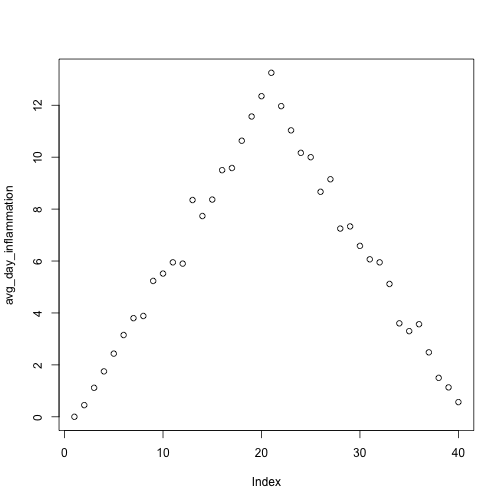

---
# Please do not edit this file directly; it is auto generated.
# Instead, please edit 02-starting-with-data.md in _episodes_rmd/
title: "Preparations"
teaching: 30
exercises: 10
questions:
- "How do I read data into R?"
- "How do I assign variables?"
- "What is a data frame?"
- "How do I calculate simple statistics like mean and median?"
- "Where can I get help?"
- "How can I plot my data?"
objectives:
- "Read tabular data from a file into a program."
- "Perform operations on a data frame of data."
- "Display simple graphs."
keypoints:
- "Objects are created on demand whenever a value is assigned to them."
- "`apply`ing the mean calculation across rows or columns has shortcuts, but other statistics may need `?apply` or `?purrr`."
- "Use `plot` to create simple visualizations."
source: Rmd
---

We are studying inflammation in patients who have been given a new treatment for arthritis,
and need to analyze the first dozen data sets.
The data sets are stored in [comma-separated values]({{ page.root }}/reference/#comma-separated-values-csv) (CSV) format. Each row holds the observations for just one patient. Each column holds the inflammation measured in a day, so we have a set of values in successive days.
The first few rows of our first file look like this:

~~~
0,0,1,3,1,2,4,7,8,3,3,3,10,5,7,4,7,7,12,18,6,13,11,11,7,7,4,6,8,8,4,4,5,7,3,4,2,3,0,0
0,1,2,1,2,1,3,2,2,6,10,11,5,9,4,4,7,16,8,6,18,4,12,5,12,7,11,5,11,3,3,5,4,4,5,5,1,1,0,1
0,1,1,3,3,2,6,2,5,9,5,7,4,5,4,15,5,11,9,10,19,14,12,17,7,12,11,7,4,2,10,5,4,2,2,3,2,2,1,1
0,0,2,0,4,2,2,1,6,7,10,7,9,13,8,8,15,10,10,7,17,4,4,7,6,15,6,4,9,11,3,5,6,3,3,4,2,3,2,1
0,1,1,3,3,1,3,5,2,4,4,7,6,5,3,10,8,10,6,17,9,14,9,7,13,9,12,6,7,7,9,6,3,2,2,4,2,0,1,1
~~~
{: .output}

We want to:

* Load data into memory,
* Calculate the average value of inflammation per day across all patients, and
* Plot the results.

To do all that, we'll have to learn a little bit about programming.

### Loading Data

Let's import the file called `inflammation.csv` into our R environment. To import the file, first we need to tell our computer where the file is. We do that by choosing a working directory, that is, a local directory on our computer containing the files we need. This is very important in R. If we forget this step we'll get an error message saying that the file does not exist. We can set the working directory using the function `setwd`. For this example, we change the path to our new directory at the desktop:

~~~
setwd("~/Desktop/FAIR-R/")
~~~
{: .language-r}

Just like in the Unix Shell, we type the command and then press <kbd>Return</kbd> (or <kbd>Enter</kbd>).
Alternatively you can change the working directory using the RStudio GUI using the menu option `Session` -> `Set Working Directory` -> `Choose Directory...`

The data file is located in the directory `data` inside the working directory. Now we can load the data into R using `read.csv`:

~~~
(dat <- read.csv(file = "inflammation.csv", header = FALSE))
~~~
{: .language-r}

The expression `read.csv(...)` is a [function call]({{ page.root }}/reference/#function-call) that asks R to run the function `read.csv`.

`read.csv` has two [arguments]({{ page.root }}/reference/#argument): the name of the file we want to read, and whether the first line of the file contains names for the columns of data.
The filename needs to be a character string (or [string]({{ page.root }}/reference/#string) for short), so we put it in quotes. Assigning the second argument, `header`, to be `FALSE` indicates that the data file does not have column headers. We'll talk more about the value `FALSE`, and its converse `TRUE`, in lesson 04. In case of our `inflammation.csv` example, R auto-generates column names in the sequence `V1` (for "variable 1"), `V2`, and so on, until `V30`.

> ## Other Options for Reading CSV Files
>
> `read.csv` actually has many more arguments that you may find useful when
> importing your own data in the future. You can learn more about these
> options in this supplementary [lesson](https://swcarpentry.github.io/r-novice-inflammation//11-supp-read-write-csv/).
{: .callout}

> ## Loading Data with Headers
>
> What happens if you forget to put `header = FALSE`? The default value is `header = TRUE`, which you can check with `?read.csv` or `help(read.csv)`. What do you expect will happen if you leave the default value? Before you run any code, think about what will happen to the first few rows of your data frame, and its overall size. Then run the following code and see if your expectations agree:
>
> ~~~
> read.csv(file = "inflammation.csv")
> ~~~
> {: .r}
{: .challenge}

> ## Reading Different Decimal Point Formats
>
> Depending on the country you live in, your standard can use the dot or the comma as decimal mark.
> Also, different devices or software can generate data with different decimal points.
> Take a look at `?read.csv` and write the code to load a file called `commadec.txt` that has numeric values with commas as decimal mark, separated by semicolons.
{: .challenge}

A function will perform its given action on whatever value is passed to the argument(s).
For example, in this case if we provided the name of a different file to the argument `file`, `read.csv` would read that instead.
We'll learn more about the details of functions and their arguments in the next lesson.

Since we included the whole line in parentheses, the console will display the full contents of the file `inflammation.csv`, which we read in assigned to the variable `dat`.
Try it out.

We can think of a variable as a container with a name, such as `x`, `current_temperature`, or `subject_id` that contains one or more values.
We can create a new variable and assign a value to it using `<-`.

Once a variable is created, we can use the variable name to refer to the value it was assigned. The variable name now acts as a tag.

To see the value of a variable, we can print it by typing the name of the variable and hitting <kbd>Return</kbd> (or <kbd>Enter</kbd>).
In general, R will print to the console any object returned by a function or operation *unless* we assign it to a variable.

> ## Variable Naming Conventions
>
> Historically, R programmers have used a variety of conventions for naming variables. The `.` character
> in R can be a valid part of a variable name; thus the above assignment could have easily been `weight.kg <- 57.5`.
> This is often confusing to R newcomers who have programmed in languages where `.` has a more significant meaning.
> Today, most R programmers 1) start variable names with lower case letters, 2) separate words in variable names with
> underscores, and 3) use only lowercase letters, underscores, and numbers in variable names. The book *R Packages* includes
> a [chapter](http://r-pkgs.had.co.nz/style.html) on this and other style considerations.
{: .callout}

When you assign a value to a variable, R only stores the value, not the calculation you used to create it. This is an important point if you're used to the way a spreadsheet program automatically updates linked cells. Let's look at an example.

For large data sets it is convenient to use the function `head` to display only the first few rows of data.

~~~
head(dat)
~~~
{: .language-r}

~~~
  V1 V2 V3 V4 V5 V6 V7 V8 V9 V10 V11 V12 V13 V14 V15 V16 V17 V18 V19 V20
1  0  0  1  3  1  2  4  7  8   3   3   3  10   5   7   4   7   7  12  18
2  0  1  2  1  2  1  3  2  2   6  10  11   5   9   4   4   7  16   8   6
3  0  1  1  3  3  2  6  2  5   9   5   7   4   5   4  15   5  11   9  10
4  0  0  2  0  4  2  2  1  6   7  10   7   9  13   8   8  15  10  10   7
5  0  1  1  3  3  1  3  5  2   4   4   7   6   5   3  10   8  10   6  17
6  0  0  1  2  2  4  2  1  6   4   7   6   6   9   9  15   4  16  18  12
  V21 V22 V23 V24 V25 V26 V27 V28 V29 V30 V31 V32 V33 V34 V35 V36 V37 V38
1   6  13  11  11   7   7   4   6   8   8   4   4   5   7   3   4   2   3
2  18   4  12   5  12   7  11   5  11   3   3   5   4   4   5   5   1   1
3  19  14  12  17   7  12  11   7   4   2  10   5   4   2   2   3   2   2
4  17   4   4   7   6  15   6   4   9  11   3   5   6   3   3   4   2   3
5   9  14   9   7  13   9  12   6   7   7   9   6   3   2   2   4   2   0
6  12   5  18   9   5   3  10   3  12   7   8   4   7   3   5   4   4   3
  V39 V40
1   0   0
2   0   1
3   1   1
4   2   1
5   1   1
6   2   1
~~~
{: .output}

### Manipulating Data

Now that our data are loaded into R, we can start doing things with them.
First, let's ask what type of thing `dat` is:

~~~
class(dat)
~~~
{: .language-r}

~~~
[1] "data.frame"
~~~
{: .output}

The output tells us that is a data frame. Think of this structure as a spreadsheet in MS Excel that many of us are familiar with.
Data frames are very useful for storing data and you will use them frequently when programming in R.
A typical data frame of experimental data contains individual observations in rows and variables in columns.

What if we need the average inflammation of each patient, or the average for each day?

~~~
avg_patient_inflammation <- rowMeans(dat)
~~~
{: .language-r}

And to obtain the average inflammation of each day we will need to calculate the mean of all of the columns of the data frame.

~~~
avg_day_inflammation <- colMeans(dat)
~~~
{: .language-r}

> ## Versatile Alternatives
>
> The common row- or column-wise `mean()` operations have the above shortcuts.
> But what if you need to perform other calculations? In base R, the family of
> `apply` functions will help you do that, see `help(apply)` or `?apply`. You
> can also learn about the modern approach with [purrr][purrr]`::`[map()][map].
{: .callout}

[purrr]: https://purrr.tidyverse.org/
[map]: https://purrr.tidyverse.org/reference/map.html

### Plotting

The mathematician Richard Hamming once said, "The purpose of computing is insight, not numbers," and the best way to develop insight is often to visualize data.
Visualization deserves an entire lecture (or course) of its own, but we can explore a few of R's plotting features.

Let's take a look at `avg_day_inflammation` using the function `plot`.

~~~
plot(avg_day_inflammation)
~~~
{: .language-r}

Above, we gave the function `plot` a vector of numbers corresponding to the average inflammation per day across all patients.
`plot` created a scatter plot where the y-axis is the average inflammation level and the x-axis is the order, or index, of the values in the vector, which in this case correspond to the 40 days of treatment.
The result is roughly a linear rise and fall, which is suspicious: based on other studies, we expect a sharper rise and slower fall.
So, either there's a mistake in our calculations or something is wrong with our data.
In the next episode, we'll create some functions to help us 

> ## Plotting Data
>
> Create a plot showing the average inflammation for each patient across all days.
{: .challenge}
