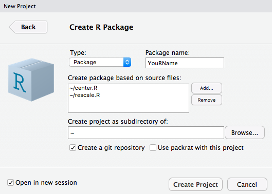
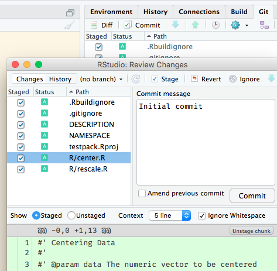

---
# Please do not edit this file directly; it is auto generated.
# Instead, please edit 04-making-packages-R.md in _episodes_rmd/
title: "Making Packages in R"
teaching: 30
exercises: 20
questions:
- "How do I collect my code together so I can reuse it and share it?"
- "How do I make my own package(s)?"
- "How do I integrate my function documentation into R's help pages system?"
- "What helper tools does RStudio provide me with?"
objectives:
- "Let RStudio create the required structure of a simple R package and review it."
- "Build and install the package in RStudio."
- "Use `roxygen2` to document functions."
keypoints:
- "A package is the basic unit of reusability in R."
- "Every package must have a `DESCRIPTION` file and an `R` directory containing code. We have to fill these manually."
- "A `NAMESPACE` file is needed as well, and a `man` directory containing documentation, but both can be autogenerated."
- "RStudio provides a package skeleton, shortcuts like `Build and install`, and a `Git` pane."
source: Rmd
---

Why should you make your own R packages?

**Reproducible research!**

An R package is the **basic unit of reusable code**.
If you want to reuse code later or want others to be able to use your code, you should put it in a package.

### Making your first R package

In this lesson, we will start building a "[personal package][PP]". This is meant to
collect any kind of R code that is useful to _you_. As you continue to evolve it
after this lesson, you may move codes that belong to the same publication, topic
or a distinct project, into their own packages. Here we begin to realise the
benefit of already documenting the functions formally earlier: 
We can publish more quickly, because we didn't leave much unfished clean-up business.

[PP]: https://hilaryparker.com/2013/04/03/personal-r-packages/

To start working on this personal package, please open RStudio's `File` menu and 
select `New Project… > New Directory… > R Package`. Give it a unique, but useful
name. Your own will work just fine. Bonus points for squeezing in an `R` ;-)

Also add the `source files` we created earlier (the first versions of `center.R`
and `rescale.R`), so that we have some example code right away.

In case you have learned about version control already, it would be a good 
practice to `create a git repository` now and `git commit` each step of
building this package.

RStudio's "skeleton" package can already be built, using the `Build > Install and Restart`
option. Note the `library(...)` line that appears in the console. 
Also, notice there is now a `package:YouRName` environment that is the parent 
environment to the global environment.

~~~
search()
~~~
{: .language-r}

This means you can now take
advantage of the console's auto-complete just like for any other package. Type
`cen` and/or `resc`, then `TAB` and test some examples like `center(c(1, 2, 3))` or 
`rescale(c(1, 2, 3))`.

## Folder and file structure of an R package

An R package requires four components:

*   a `DESCRIPTION` file with metadata about the package
*   an `R` directory with the code
*   a `man` directory with documentation (we will create this automatically)
*   a `NAMESPACE` file listing user-level ("exported") functions in the package (we will also create this automatically)

*There are other optional components. [Read the "R packages" book][r-pkgs-desc] and/or the original ["Writing R Extensions" documentation][WRE] for much more information.*

[r-pkgs-desc]: http://r-pkgs.had.co.nz/description.html
[WRE]: https://cran.r-project.org/doc/manuals/r-release/R-exts.html#Package-structure

### .R files

Functions don't all have to be in one file or each in separate files.
How you organize them is up to you.
Suggestion: organize in a logical manner so that you know which file holds which functions.

### `DESCRIPTION` file

~~~
Package: PackageName
Type: Package
Title: What the Package Does (Title Case)
Version: 0.1.0
Author: Who wrote it
Maintainer: The package maintainer <yourself@somewhere.net>
Description: More about what it does (maybe more than one line)
    Use four spaces when indenting paragraphs within the Description.
License: What license is it under?
Encoding: UTF-8
LazyData: true
~~~
{: .source}

The package name can only contain letters and numbers and has to start with a letter.

> ## Provide citation metadata in the `DESCRIPTION` file
>
> R supports citing R packages. Have a look at the output of `citation(YouRName)`.
> Does anything seem to be missing? If yes, how and where do you think we can add
> that information?
>
> Assuming you have an ORCiD, you may want to associate your R package with it.
> Find out how to add this information, and which additional changes you can make
> to the `DESCRIPTION` file.
> >
> > ## Hint
> > 
> > One useful resource to find the answer to such technical details is GitHub.
> > Search for `org:ROpenSci filename:DESCRIPTION` plus
> > [`2018`](https://github.com/search?q=org%3AROpenSci+filename%3ADESCRIPTION+2018)
> > or [`orcid`](https://github.com/search?q=org%3AROpenSci+filename%3ADESCRIPTION+orcid)
> > for example.
> {: .solution}
> 
> > ## Solution
> > 
> > The date is added in [ISO 8601](https://en.wikipedia.org/wiki/ISO_8601) format:
> > `date: 2018-07-12`.
> > 
> > Before inserting the ORCiD, we have to merge the `Author` and `Maintainer`
> > fields into a machine-readable `Authors@R` field using the `person(…)`.
> > function. Look up its help page and convert your information.
> > Afterwards, add your ORCiD as a `comment = c(ORCID = "…")`.
> {: .solution}
{: .challenge}

### Converting function documentation to help pages

Remember that we documented our functions with roxygen comments?
Let's try and look it up:

~~~
?center
help(rescale)
~~~
{: .language-r}

> ## Why `No documentation for '…' in specified packages and libraries`? We did write it!
>
> Why do you think the documentation of our package can not be found. Hint: Look
> at the commit diff.
> >
> > ## Solution
> > 
> > We did not yet tell R to actually generate the `man`ual files and folders in
> > our package. This needs to be done with `roxygen2::roxygenise()`
> > 
> {: .solution}
{: .challenge}

After `Install and Restart`-ing again, looking up the documentation should work.

What exactly does `roxygen2` do? It reads lines that begin with `#'` as the function documentation for your package.
Descriptive tags are preceded with the `@` symbol. For example, `@param` has information about the input parameters for the function.

### Exporting "user-level" function

We haven't talked about the `NAMESPACE` file yet! It belongs to the package skeleton,
and was set up by RStudio with an `exportPattern`. Any file name in `R/` that
matches it is automatically exported, meaning offered to users of your package
in the console's tab-completion.

In case you want to publish your package and keep some functions hidden (maybe
because they only do auxiliary tasks), you should delete this default file, tag
the functions you _do want to expose_ with `@export` and rerun `roxygenise()`.

Learn more about this from the ["R packages" book][r-pkgs-name].

[r-pkgs-name]: http://r-pkgs.had.co.nz/namespace.html

### Finishing up

Please take a look at RStudio's `Files` panes now. The `/man` directory should
now contain one LaTeX-like formatted `.Rd` file for each function.

In case you learned about Git already, also view the `.Rd` files in RStudio's
`Git` pane and commit the documentation.

> ## How would you word the commit message?
>
> "Add docu" is a bit moot, because that's obvious from the filenames and contents.
> Which other messages would better explain the "Why?", or that would be more useful
> when browsing the commit history later?
> >
> > ## Hints
> > 
> > - "roxygenise() function comments into help pages" because it mentions the 
> >    package and command you used
> > - "Integrate function docu into R's standard help pages"
> > - "Render function docu as R's standard help pages"
> > 
> {: .solution}
{: .challenge}

Also, after `roxygenise()`-ing the function docu, you can tell R to run the examples.
Using R's `example()` function on another function's name saves you from
scrolling down its help page, copying the example code and pasting it into the
console.

~~~
example(center)
example(rescale)
~~~
{: .language-r}

This was our basic introduction to packaging up R functions. To go on from here,
remember to functionalise R code that you use repeatedly and incorporate it into
your personal package. A good resource to find more guidance on packaging R code
is [ROpenSci's onboarding guide][ROSPG].

[ROSPG]: https://onboarding.ropensci.org/packaging_guide.html
[ep-func]: {{ page.root }}/03-func-R/
